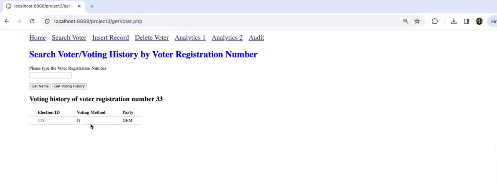
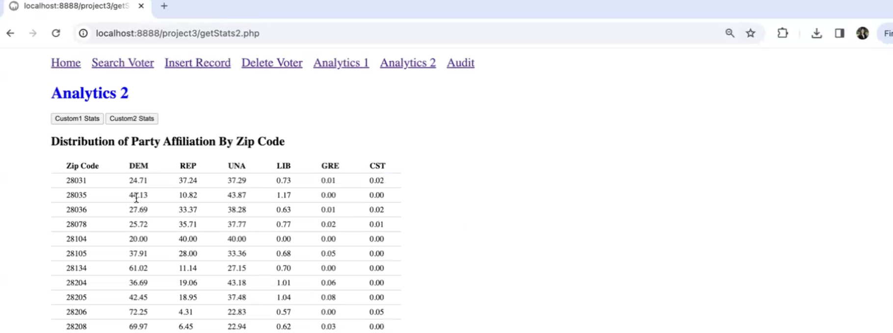

# Mecklenburg County Voter Database Project (DS 5420)
> Spring 2024

## Project Overview
This project involves working with real-world voter data from Mecklenburg County, NC. The main objectives are to import a large CSV dataset into a MySQL database, perform data cleaning, conduct data analysis, and implement various database operations and analytics.

https://github.com/user-attachments/assets/520ddb83-acfe-4714-906d-3c971c0f3357

## Data Source
The data is sourced from the Mecklenburg County Board of Elections voter data file. The cleaned dataset is provided as a 160 MB CSV file. The data contains P.I.I. and was provided by our professor therefore cannot be made publicly available. 

## Project Objectives and Description 

1. Database Creation & Structure
    * Created a MySQL database with a table structure matching the provided voter registration CSV data
    * Implemented proper data types and constraints for all attributes
    * Designed a schema that efficiently stores and retrieves voter information

2. Data Import & Processing
    * Configured MySQL to properly import the semicolon-delimited CSV file
    * Handled special character encoding and field enclosure with the LOAD DATA INFILE statement
    * Processed date formatting and empty string values during import with conditional logic

3. Data Cleaning & Validation
    * Identified and managed duplicate voter records by keeping the most recent registration
    * Handled missing precinct data (258 records with NULL pct_portion)
    * Resolved name inconsistencies across fields (e.g., inconsistencies between full_name_mail and component name fields)
    * Moved problematic records (290 total) to a separate misc_table for further investigation

4. Database Normalization
    * Analyzed functional dependencies between attributes through systematic SQL queries
    * Performed normalization through 3NF (Third Normal Form) based on discovered dependencies
    * Created properly normalized tables with appropriate primary and foreign keys:
      * voter - Core voter registration information
      * voter_name - Name components separated from main voter data
      * voter_mailing_address - Mailing address information
      * city_state - Lookup table for ZIP codes to cities and states
      * nc_senate_desc - Senate district information by precinct
      nc_house_desc - House district information by precinct portion
      * address_pct_portion - Links residential addresses to precinct portions
      * election_votes - Voting records for each election
      * election_info - Election metadata (dates, types)

5. Stored Procedures Implementation
  * get_voting_record - Retrieves a voter's complete voting history
  * insert_record - Handles inserting or updating election voting records with transaction control
  * delete_voter - Manages cascading deletion of voter records with proper referential integrity

6. Trigger System
  * insert_person and update_person - Validates party codes for new/updated records
  * election_votes_after_insert and election_votes_after_update - Creates audit trail entries
  * voter_before_delete - Captures voter information before deletion for the audit log

7. Analytics Views
  * constituent_stats - Party affiliation distribution with percentages
  * dem_region_stats_1 - Geographic distribution of Democratic voters
  * dem_gender_stats - Gender distribution of Democratic voters
  * party_by_zip_stats - Party affiliation percentages by ZIP code
  * age_by_race_stats - Age distribution by race
  * switched_election procedure - Identifies voters who switched parties in specific elections
  * Custom views for demographic and geographic analysis across multiple dimensions

## Database Schema
The normalized database contains the following tables:

  * voter (voter_reg_num, full_name_mail, age, registr_dt, party_cd, race_code, ethnic_code, sex_code, house_num, street_dir, street_name,  
  street_type_cd, street_sufx_cd, zip_code, mail_addr1)
  * voter_name (full_name_mail, first_name, middle_name, last_name, name_suffix_lbl)
  * voter_mailing_address (full_name_mail, mail_addr1, mail_addr2, mail_city_state_zip)
  * city_state (zip_code, city, state_cd)
  * nc_senate_desc (precinct_desc, nc_senate_desc)
  * nc_house_desc (pct_portion, precinct_desc, nc_house_desc)
  * address_pct_portion (house_num, street_dir, street_name, street_type_cd, street_sufx_cd, zip_code, pct_portion)
  * election_votes (voter_reg_num, election_number, voting_method, party_cd)
  * election_info (election_number, election_date)

## Data Integrity Features

  * Transactional Operations: All critical operations use transactions for atomicity
  * Referential Integrity: Proper foreign key constraints with cascade rules for updates/deletes
  * Audit System: Comprehensive tracking of inserts, updates, and deletions
  * Data Validation: Input validation for party codes and other critical fields
  * Error Handling: Robust error handling with diagnostic information

## Functional Dependencies Analysis

  * full_name_mail, mail_addr1, registr_dt, age → voter_reg_num
  * zip_code → res_city_desc, state_cd
  * precinct_desc → nc_senate_desc
  * pct_portion → precinct_desc, nc_house_desc
  * house_num, street_dir, street_name, street_type_cd, street_sufx_cd, zip_code → pct_portion
  * full_name_mail → first_name, middle_name, last_name, name_suffix_lbl
  * election_number → election_date

## Implemented Features
- Voter record search

- Voter record insertion/update with auditing

- Voter history

- Voter record deletion with auditing
- Various analytical views (e.g., constituent stats, demographic stats)

- Custom analytics (e.g., party distribution by zip code, age distribution by race)

## Usage
Detailed instructions on how to set up the database, import data, and use the implemented features are provided in the SQL files.

## Acknowledgements
This project is based on data from the Mecklenburg County Board of Elections and is part of a database management course assignment.
